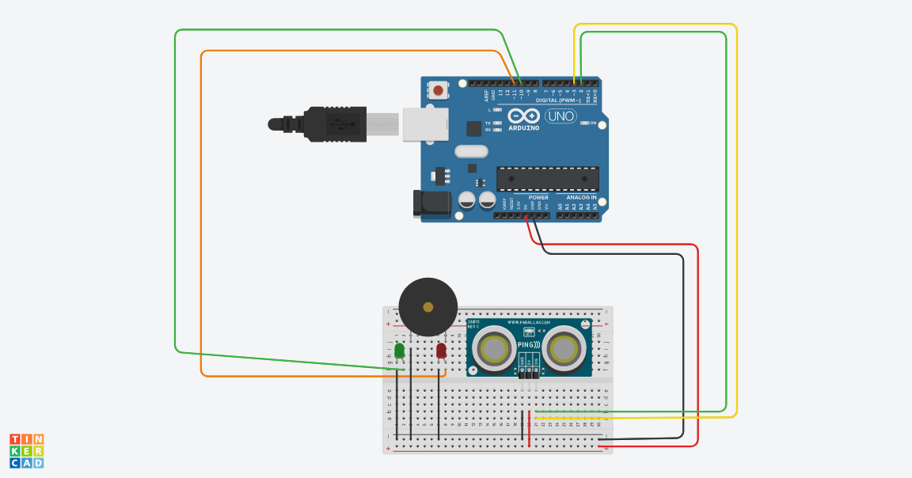

# Circuíto

# Dependências

Biblioteca do Ultrasonic (Baixada do gerenciador de bibliotecas do Arduino IDE)

# Componentes Utilizados

- 1 Arduino UNO R3
- 1 Protoboard
- 1 Sensor de Distância Ultrassônico (`HC-SR04`)
- 1 Piezo
- 1 LED Vermelho
- 1 LED Verde
